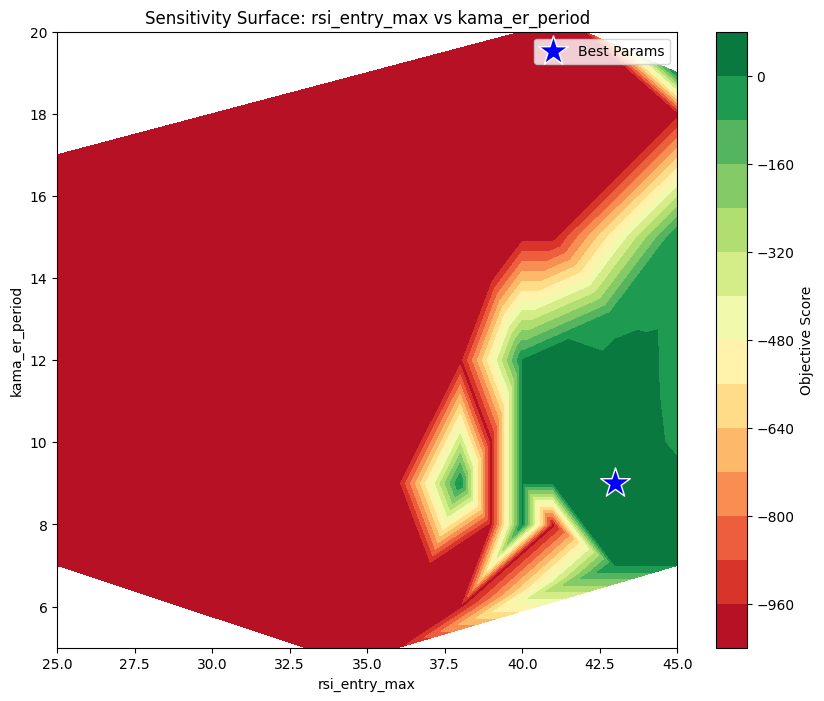
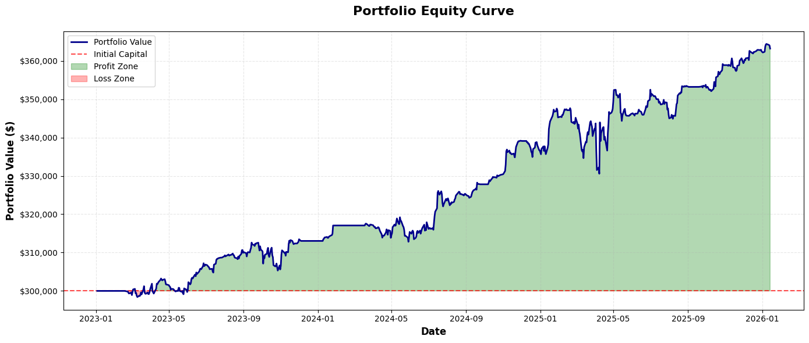
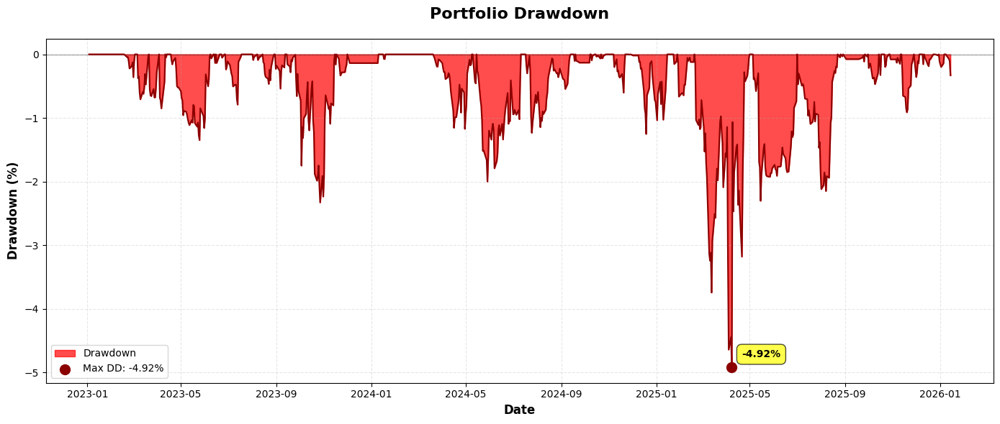

# AMA-KAMA: Dual Adaptive Momentum

A trend-reversion system that pairs two variations of Perry Kaufman's Adaptive Moving Average to identify high-fidelity entries, filtered by volatility regimes.
{: .fs-5 .fw-300 }

[View Script](/notebooks/alpha-research/strategies/05-strategy-ama-kama.html){:target="_blank" rel="noopener noreferrer"} -  [Github Repository](https://github.com/xxxxyyyy80008/systematic-trading-strategies){:target="_blank" rel="noopener noreferrer"}
{: .fs-2 .fw-300 }

---

## Strategy Profile

| Metric | Value |
| :--- | :--- |
| **Logic Class** | Dual Adaptive Trend / Mean Reversion |
| **Validation Status** | Robust (35.66% Degradation) |
| **Best Optimization Score** | 0.9268 (Sharpe) |
| **Global Holdout Sharpe** | **1.27** (2023–2025) |
| **Win Rate** | 65.43% |
| **Risk Profile** | Conservative (Max DD -4.92%) |

### Overview
This strategy moves beyond standard static trendlines by pitting two adaptive indicators against each other:
1.  **AMA (Adaptive Moving Average):** The primary "Fast" signal line (Period 14), configured to react quickly to efficiency changes.
2.  **KAMA (Kaufman Adaptive Moving Average):** The "Slow" baseline (Period 28), acting as the trend anchor.

By using two adaptive averages, the strategy dynamically adjusts its crossover sensitivity. In chop/noise, both lines flatten, reducing false signals. The system enters on momentum crossovers (AMA > KAMA) strictly when the asset is in a "value" state (RSI < 43) and exits on **either** trend reversal or significant overextension (RSI > 74).

---

## Signal Logic Specification

The strategy employs a **State + Trigger** mechanism for entry, and a flexible **Multi-Condition** mechanism for exit.

### 1. Indicators
*   **AMA:** Period 14 (Fast smoothing 4, Slow 40).
*   **KAMA:** Period 28 (Fast 2, Slow 30, ER Period 9).
*   **RSI:** Period 16.

### 2. Entry Logic (Long)
A long position is initiated when the faster adaptive momentum overtakes the adaptive baseline, confirmed by a recent oversold condition.
*   **Trigger:** The AMA crosses **above** the KAMA.
*   **State Filter:** The RSI is (or was within the last 3 bars) below the **Entry Threshold**.

$$ \text{Entry} = (\text{AMA} \uparrow \text{KAMA}) \land (\text{Max}(\text{RSI}_{t-2} \dots \text{RSI}_t) < \text{Threshold}_{\text{Entry}}) $$

### 3. Exit Logic
The trade is closed when **either** the trend breaks **or** the asset becomes significantly overextended.
*   **Condition A (Trend Break):** The AMA crosses **below** the KAMA.
*   **Condition B (Overbought):** The RSI rises above the **Exit Threshold**.

$$ \text{Exit} = (\text{AMA} \downarrow \text{KAMA}) \lor (\text{RSI}_t > \text{Threshold}_{\text{Exit}}) $$

---

## Optimized Configuration & Parameter Stability

The strategy was tuned via Walk-Forward Analysis. The results highlight a shift toward holding positions for larger extensions (Exit RSI 74) compared to previous iterations.

| Parameter | Optimized Value | Role | Stability (CV) | Assessment |
| :--- | :--- | :--- | :--- | :--- |
| **ama_period** | **14** | Fast Signal Lookback | 0.082 | **Excellent** |
| **kama_period** | **28** | Baseline Trend Lookback | 0.047 | **Excellent** |
| **rsi_entry_max** | **43** | Undervalued Zone Limit | 0.034 | **Excellent** |
| **rsi_exit_min** | **74** | Profit Take Threshold | 0.022 | **Excellent** |

### Key Insights
*   **Universal Constants:** Both `ama_fast` and `kama_fast` achieved a CV of **0.000**. This indicates that the optimal "fast" reaction speed for adaptive averages is a universal constant (approx 2-4) across all market regimes tested.
*   **Deep Value Dependency:** The `rsi_entry_max` is the single most critical parameter (61% importance). The strategy relies heavily on buying "cheap" (RSI < 43). It is functionally a **Mean Reversion** strategy that uses adaptive trends for timing, rather than a pure trend follower.
*   **Extended Hold Times:** The optimal exit threshold rose to **74**. This suggests the strategy generates alpha by holding through minor fluctuations to capture deep overbought conditions.

---

## Robustness Analysis

### 1. Degradation Analysis
*   **Avg Sharpe Degradation:** **35.66%**
*   **Assessment:** **Robust.**
    *   The strategy retains roughly 65% of its in-sample performance on unseen data. This is a healthy degradation rate for a system with multiple filters.

### 2. Parameter Importance (MDI)
Feature importance analysis reveals the strategy is dominated by the entry state:

| Parameter | Importance | Interpretation |
| :--- | :--- | :--- |
| **rsi_entry_max** | **61.62%** | **Dominant Driver.** Identifying the correct "value" zone is critical. |
| **kama_er_period** | 8.68% | The efficiency ratio lookback is a distant second. |
| **kama_fast** | 6.39% | The reaction speed of the baseline. |

### 3. Sensitivity Surface 

[View Script with Full Output](/notebooks/alpha-research/strategies/05-strategy-ama-kama.html){:target="_blank" rel="noopener noreferrer"}
{: .fs-2 .fw-300 }

 

---

## Global Holdout Performance (2023–2025)

The strategy delivered solid, low-volatility returns in the holdout period.

### 1. Performance Summary

| Metric | Result |
| :--- | :--- |
| **Total Return** | **21.07%** |
| **Sharpe Ratio** | **1.27** |
| **Sortino Ratio** | **1.58** |
| **Max Drawdown** | **-4.92%** |
| **Win Rate** | **65.43%** |
| **Profit Factor** | **2.87** |

### 2. Trade Statistics
*   **Total Trades:** 81 (Moderate Frequency)
*   **Avg Trade:** $807.79
*   **Best/Worst:** +$7,455 / -$7,558

### 3. Portfolio Equity Curve

 

### 4. Portfolio Drawdown 

 

### 5. Strategy Signals (Ticker - `CAT`)  

 

[View Strategy Signals Script for All Tickers](/notebooks/alpha-research/strategies/05-strategy-ama-kama.html){:target="_blank" rel="noopener noreferrer"}
{: .fs-2 .fw-300 }

### Conclusion
The AMA-KAMA strategy has evolved into a **conservative mean-reversion system**. With a Max Drawdown of only **-4.92%** over two years and a Profit Factor of **2.87**, it prioritizes capital preservation. The high trade count (81) compared to previous versions indicates the relaxed AMA period (14) allows for more opportunities, while the strict RSI entry filter (43) ensures quality control.
