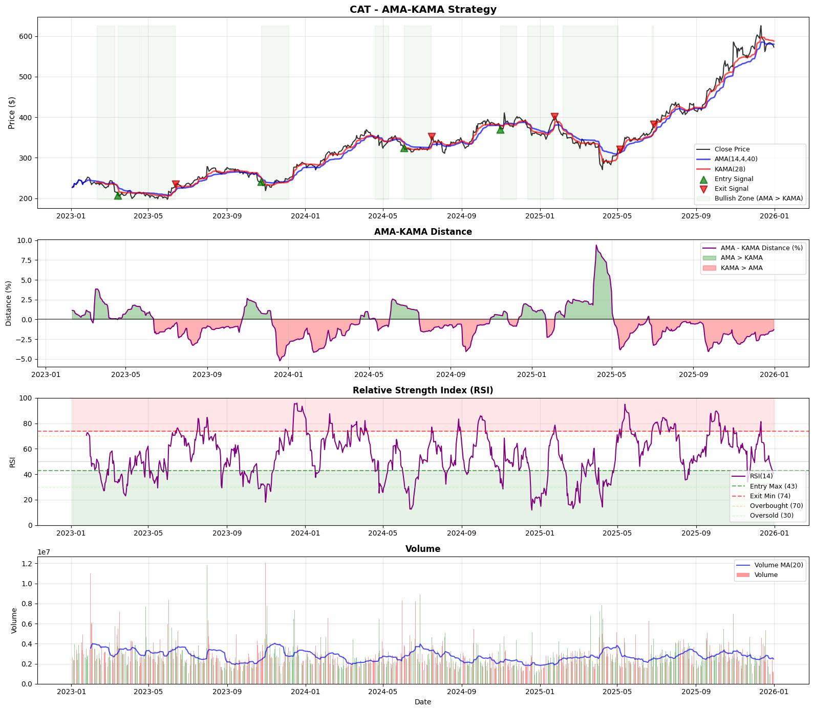

# Systematic Trading Strategies & Backtesting

Systematic trading algorithms validated through Walk-Forward Analysis.
{: .fs-5 .fw-300 }

[Github Repository](https://github.com/xxxxyyyy80008/systematic-trading-strategies){:target="_blank" rel="noopener noreferrer"}
{: .fs-2 .fw-300 }

## Performance Matrix

The following table summarizes the current status of the strategy pipeline. Strategies are graded based on their Out-of-Sample (OOS) robustness and parameter stability.

| Strategy | Logic Class | Validation Status | Risk Profile |Script|
| :--- | :--- | :--- | :--- |:--- |
| **[SMI Momentum](./smi/)** | Mean Reversion / Oscillator | Very Robust (-19.4% Degradation)|  Moderate (High Win Rate) |[View Script](/notebooks/alpha-research/strategies/02-strategy-smi.html){:target="_blank" rel="noopener noreferrer"}|
| **[AMA-KAMA](./ama-kama/)** | Dual Adaptive Trend / Mean Reversion | Robust (35.66% Degradation) | Conservative  |[View Script](/notebooks/alpha-research/strategies/05-strategy-ama-kama.html){:target="_blank" rel="noopener noreferrer"}|
| **[MABW](./mabw/)** | Volatility Expansion / Breakout | Rejected (100% Degradation) | Aggressive / Unstable |[View Script](/notebooks/alpha-research/strategies/01-strategy-mabw.html){:target="_blank" rel="noopener noreferrer"}|

---

## Strategy Summaries

### 1. [SMI (Stochastic Momentum Index)](./smi/)
A highly robust mean-reversion system that identifies deep value entries within medium-term volatility cycles.
*   **Concept:** This strategy filters for "Deep Oversold" regimes—where price deviates significantly below the midpoint—and triggers entries only when momentum confirms a reversal (signal line crossover). 
*   **Status:** High win rate with low parameter degradation (-19.4%).
*   **Strategy Signals :** Example ticker - `V`
 

### 2. [AMA-KAMA (Dual Adaptive Momentum)](./ama-kama/)
A trend-reversion system that pairs two variations of Perry Kaufman's Adaptive Moving Average to identify high-fidelity entries, filtered by volatility regimes.
*   **Concept:** By using two adaptive averages, the strategy dynamically adjusts its crossover sensitivity. In chop/noise, both lines flatten, reducing false signals. 
*   **Status:** High robustness with low parameter degradation (35%).
*   **Strategy Signals :** Example ticker - `V`
 

### 3. [MABW (Moving Average Band Width)](./mabw/)
A systematic trend-following strategy that exploits volatility clustering by entering trends during periods of extreme compression and exiting during excessive expansion.
*   **Concept:** The MABW (Moving Average Band Width) strategy is predicated on the **Volatility Clustering** hypothesis. It posits that extended periods of low volatility are structural precursors to significant price expansions. The strategy identifies "Regime Squeezes"—where the spread between a Fast and Slow Moving Average hits a historical low—and enters positions only when a momentum trigger (EMA) confirms a breakout from this compression.
*   **Status:** **Failed Validation.** The strategy exhibited 100% performance degradation in out-of-sample testing, indicating severe overfitting to historical anomalies. 
