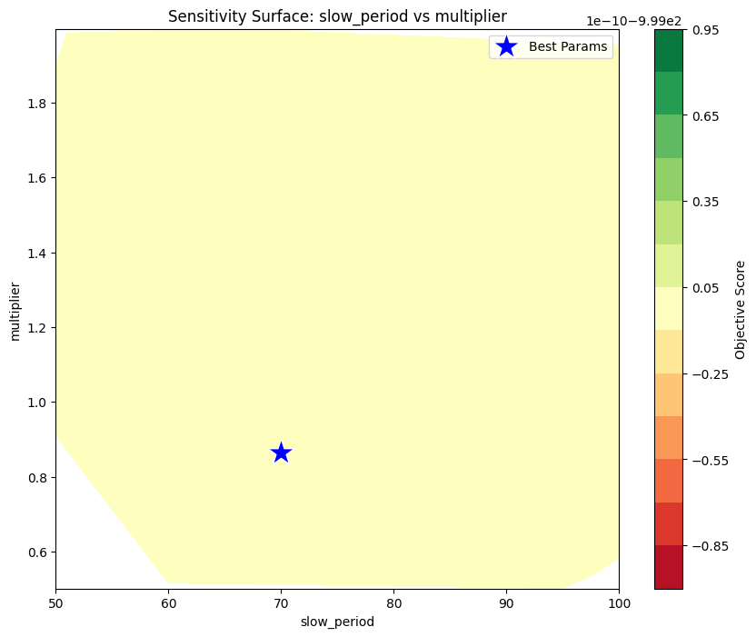
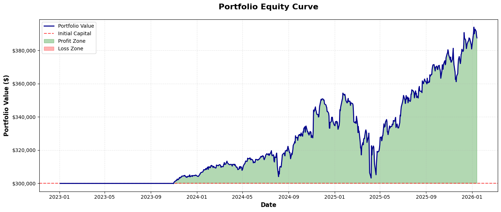
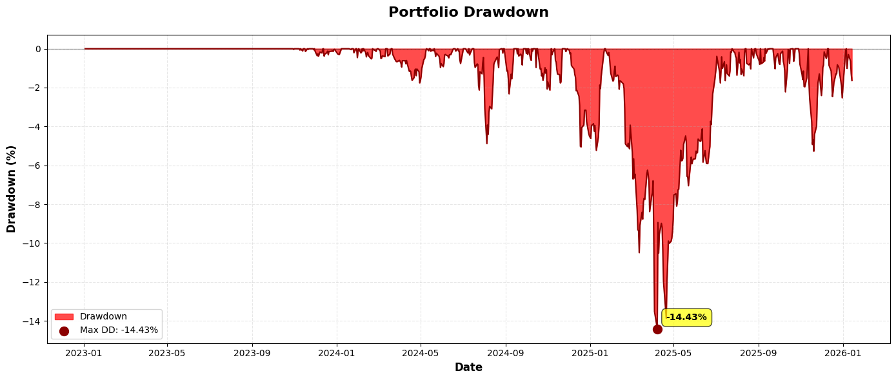
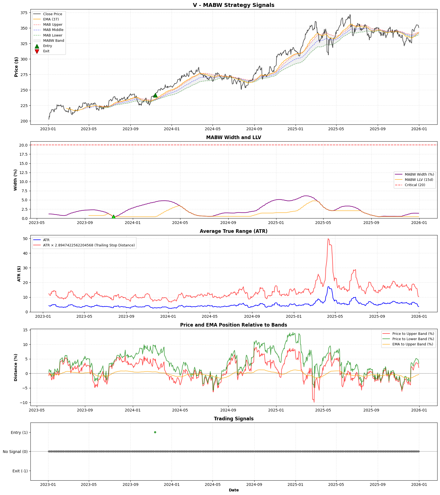

# MABW: Volatility Breakout Strategy

A systematic trend-following strategy that exploits volatility clustering by entering trends during periods of extreme compression and exiting during excessive expansion.
{: .fs-5 .fw-300 }

[View Script](/notebooks/alpha-research/strategies/01-strategy-mabw.html){:target="_blank" rel="noopener noreferrer"} -  [Github Repository](https://github.com/xxxxyyyy80008/systematic-trading-strategies){:target="_blank" rel="noopener noreferrer"}
{: .fs-2 .fw-300 }

---

## Strategy Profile

| Metric | Value |
| :--- | :--- |
| **Logic Class** | Volatility Expansion / Breakout |
| **Primary Tickers** | GS, MSFT, HD, V, SHW, CAT, MCD, UNH, AXP |
| **Validation Status** | Rejected (100% Degradation) |
| **Trade Frequency** | Ultra-Low (~0.5 trades/ticker/year) |
| **Optimization Score** | -999.0 (Failed Convergence) |

### Overview
The MABW (Moving Average Band Width) strategy is predicated on the **Volatility Clustering** hypothesis. It posits that extended periods of low volatility are structural precursors to significant price expansions. The strategy identifies "Regime Squeezes"—where the spread between a Fast and Slow Moving Average hits a historical low—and enters positions only when a momentum trigger (EMA) confirms a breakout from this compression.

---

## Signal Logic

The strategy utilizes a functional, state-free logic flow using vectorized boolean operations.

### 1. Indicator Construction
*   **MABW Bands:** Defined by the spread between a Fast MA and a Slow MA, scaled by a multiplier.
    $$ \text{Width} = \text{MA}_{fast} - \text{MA}_{slow} $$
*   **Regime Filter (LLV):** The Lowest Low Value of the `Width` over a lookback period $$ N $$.
*   **Trigger:** An Exponential Moving Average (EMA) of the Close price.

### 2. Entry Signal (Long Only)
A buy signal is generated if and only if **both** conditions are met simultaneously:
1.  **Compression (Squeeze):** The current Band Width is at its $$N$$-day low.
    $$ \text{Width}_t \le \text{LLV}(\text{Width}, \text{Period}_{LLV}) $$
2.  **Breakout (Momentum):** The Signal EMA crosses *above* the Upper Band.
    $$ (\text{EMA}_t > \text{UpperBand}_t) \land (\text{EMA}_{t-1} \le \text{UpperBand}_{t-1}) $$

### 3. Exit Signal
The trade is closed when volatility expands beyond a sustainable threshold (Blow-off), indicating trend exhaustion.

$$ \text{Signal}_{Exit} = \text{Width}_t > \text{Critical Threshold}_{Width} $$

---

## Configuration & Performance

The following configuration was identified during the global search but is considered **unstable**.

| Parameter | Optimized Value | Description |
| :--- | :--- | :--- |
| `fast_period` | **35** | Fast MA Lookback |
| `slow_period` | **70** | Slow MA Lookback |
| `multiplier` | **0.86** | Band Width Scaler |
| `ema_period` | **37** | Breakout Signal Line |
| `mabw_llv_period` | **15** | Squeeze Definition Lookback |
| `mab_width_critical` | **20** | Exit Threshold |

## Robustness & Validation Analysis

The strategy completely failed the Walk-Forward Validation phase.

### 1. Degradation Analysis
*   **Sharpe Degradation:** **100.00%**
*   **Assessment:** **Critical Failure.** The strategy performs significantly worse on unseen data than during training. The optimization score of `-999.0` suggests the optimizer could not find a region that satisfied minimum stability constraints.

### 2. Parameter Stability (Cluster Analysis)
The optimization surface is chaotic. The Coefficient of Variation (CV) is high for almost all parameters, indicating that small adjustments break the strategy.

| Parameter | Stability (CV) | Assessment |
| :--- | :--- | :--- |
| `slow_period` | 0.197 | Moderate |
| `mab_width_critical` | 0.333 | **Poor** |
| `multiplier` | 0.359 | **Poor** |
| `ema_period` | 0.468 | **Poor** |
| `mabw_llv_period` | 0.547 | **Poor** |

### 3. Parameter Importance

The importance analysis returned `0.0` for all parameters. This statistical anomaly typically occurs when the "Performance vs Parameter" relationship is non-linear or random, further confirming that the strategy's success in the backtest was random chance rather than structural edge.

**Sensitivity Surface:**

[View Script with Full Output](/notebooks/alpha-research/strategies/01-strategy-mabw.html){:target="_blank" rel="noopener noreferrer"}
{: .fs-2 .fw-300 }

 

## Global Holdout Results (2023–2025)

### 1. Performance Summary

*   **Total Return:** 29.19%
*   **Sharpe Ratio:** 0.92
*   **Max Drawdown:** -14.43%
*   **Win Rate:** 77.78%
*   **Profit Factor:** 6.97
*   **Total Trades:** 9

### 2. Observation

The extremely high Profit Factor (6.97) coupled with very low trade count (9 trades across 9 tickers over ~3 years) confirms the strategy is "cherry-picking" specific high-magnitude trends (likely in MSFT or CAT) rather than exploiting a recurring market inefficiency.

### 3. Portfolio Equity Curve

 

### 4. Portfolio Drawdown 

 

### 5. Strategy Signals (Ticker - `V`)  

 

[View Strategy Signals Script for All Tickers](/notebooks/alpha-research/strategies/01-strategy-mabw.html){:target="_blank" rel="noopener noreferrer"}
{: .fs-2 .fw-300 }

## Conclusion 
**REJECT FOR PRODUCTION.**

The MABW strategy is a classic example of **Curve Fitting**.
*   **Diagnosis:** It found a specific combination of `ema_period` (37) and `mabw_llv_period` (15) that happened to align with a few massive trends in the specific ticker set (GS, MSFT, etc.).
*   **Prognosis:** It is extremely unlikely to repeat this performance. The logic is too rigid (`ema_period` and `mabw_llv_period` are unstable) to adapt to future volatility regimes.
