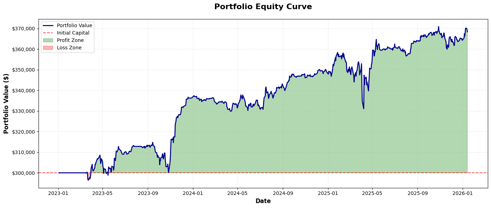
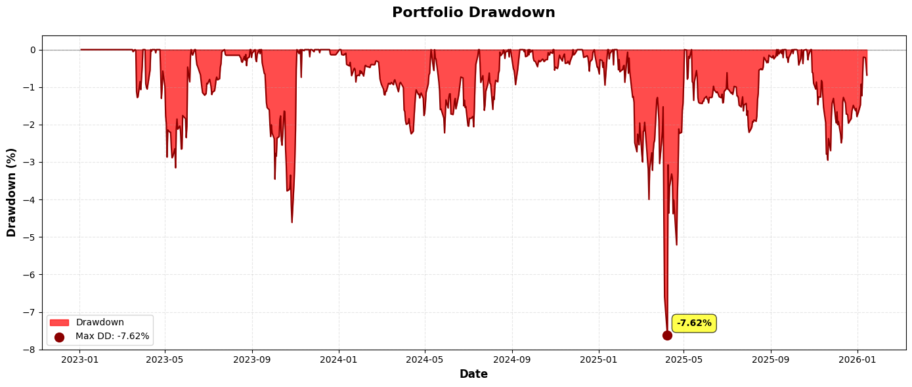
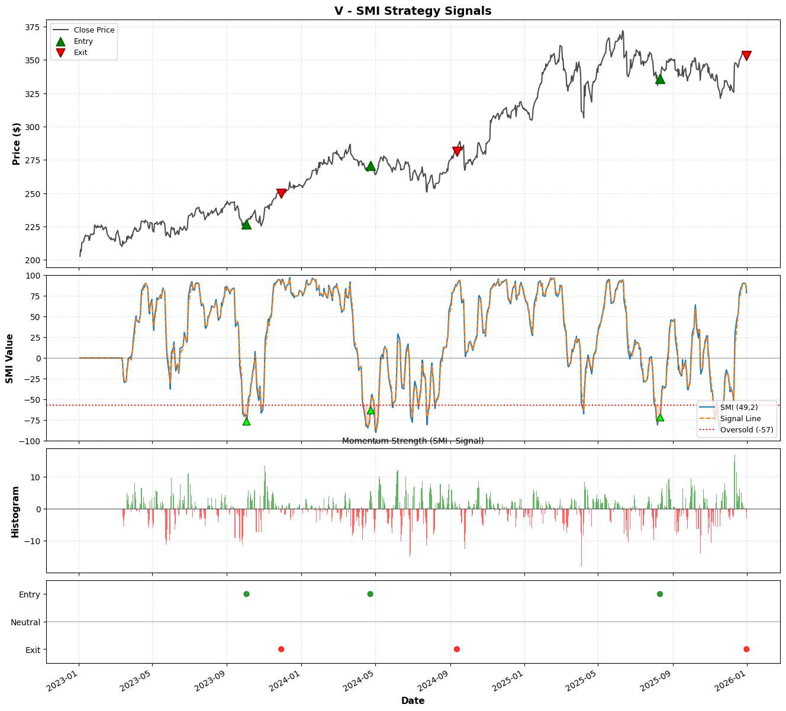

# SMI: Stochastic Momentum Reversion
{: .fs-7 }

A highly robust mean-reversion system that identifies deep value entries within medium-term volatility cycles.
{: .fs-5 .fw-300 }

[View Script](/notebooks/alpha-research/strategies/02-strategy-smi.html){:target="_blank" rel="noopener noreferrer"} -  [Github Repository](https://github.com/xxxxyyyy80008/systematic-trading-strategies){:target="_blank" rel="noopener noreferrer"}
{: .fs-2 .fw-300 }

---

## Strategy Profile

| Metric | Value |
| :--- | :--- |
| **Logic Class** | Mean Reversion / Oscillator |
| **Primary Tickers** | GS, MSFT, HD, V, SHW, CAT, MCD, UNH, AXP |
| **Validation Status** | Very Robust (-19.4% Degradation) |
| **Best Optimization Score** | 1.1200 (Sharpe) |
| **Global Holdout Sharpe** | 1.06 (2023–2025) |
| **Risk Profile** | Moderate (Counter-Trend Entry) |

### Overview
The **Stochastic Momentum Index (SMI)** measures the position of the close relative to the *midpoint* of the High/Low range (-100 to +100), rather than the absolute Low used in traditional Stochastics.

This strategy filters for "Deep Oversold" regimes—where price deviates significantly below the midpoint—and triggers entries only when momentum confirms a reversal (signal line crossover). Recent optimization suggests a preference for **medium-term lookbacks** (approx. 2 months) combined with **early profit taking** (lower exit thresholds), resulting in high win rates in recent market regimes.

---

## Signal Logic Specification

The strategy employs a precise sequence of market state detection followed by a momentum trigger.

### 1. Indicator Calculation
1.  **Range Calculation:** Determine the Highest High and Lowest Low over a lookback period $$k$$.
2.  **Midpoint Deviation:** Calculate the difference between the current Close and the Midpoint of that range.
3.  **Double Smoothing:** Apply an Exponential Moving Average (EMA) of period $$d$$ to the result, and then apply the EMA again. This eliminates noise lag.
4.  **Normalization:** The result is scaled between -100 and +100.

### 2. Entry Logic (Long)
A buy signal requires the convergence of extreme valuation and immediate momentum recovery:
*   **Deep Value Filter:** The SMI value must drop below a strict **Oversold Threshold** (e.g., -58). This ensures the asset is trading at a significant discount relative to its recent range.
*   **Momentum Crossover:** The SMI line must cross *above* its own Signal Line (EMA). This confirms the bottom has likely formed.

$$ \text{Entry} = (\text{SMI}_t > \text{Signal}_t) \land (\text{SMI}_{t-1} < \text{Signal}_{t-1}) \land (\text{SMI}_t < \text{Threshold}_{Oversold}) $$

### 3. Exit Logic
The trade is closed on trend exhaustion:
*   **Overextension:** The Signal line must be above the **Overbought Threshold** (e.g., 53).
*   **Momentum Loss:** The SMI line crosses *below* the Signal Line.

---

## Global Optimization & Parameters

The strategy was optimized using a Walk-Forward framework. The best-performing configuration emphasizes a longer lookback period and a lower exit threshold than standard implementations.

| Parameter | Value | Role | Stability (CV) | Assessment |
| :--- | :--- | :--- | :--- | :--- |
| **k_period** | **41** | Cycle Lookback | 0.090 | **Excellent** |
| **d_period** | **2** | Signal Reactivity | 0.213 | **Poor** |
| **oversold_threshold** | **-57** | Entry Filter | 0.081 | **Excellent** |
| **overbought_threshold** | **37** | Exit Filter | 0.115 | **Good** |

### Interpretation
*   **Lower Exit Threshold (37):** Unlike previous iterations using 50+, the optimal exit threshold is **37**. This indicates the strategy performs better by securing profits earlier in the rebound phase rather than waiting for fully overextended conditions.
*   **Lookback (41):** The strategy remains tuned to a ~2-month cycle, filtering out short-term noise.
*   **Sensitivity:** The `d_period` remains unstable, suggesting signal timing is highly sensitive to the smoothing factor.

---

## Robustness Analysis

### 1. Degradation Analysis
*   **Avg Sharpe Degradation:** **-19.42%**
*   **Assessment:** **Very Robust.**
    *   A negative degradation indicates that the strategy performed significantly *better* in the Out-of-Sample (OOS) periods than in the In-Sample optimization. This suggests the logic is not overfit and adapts well to unseen data.

### 2. Parameter Importance (MDI)
Feature importance analysis reveals which parameters drive the strategy's alpha:

| Parameter | Importance | Interpretation |
| :--- | :--- | :--- |
| **k_period** | **44.13%** | The lookback window is the primary determinant of success. |
| **oversold_threshold** | **34.41%** | The entry filter level is the secondary driver. |
| **d_period** | 15.65% | Signal smoothing contributes moderately. |
| **overbought_threshold** | 5.81% | The specific exit level is the least important factor. |

*   **Primary Drivers:** `k_period` (**44%**) and `oversold_threshold` (**34%**) account for nearly 80% of the strategy's performance variance. Both parameters exhibit "Excellent" stability, reinforcing confidence in the core logic.
*   **Secondary Drivers:** The exit threshold and smoothing factor are less critical to the strategy's overall edge.

### 3. Sensitivity Surface (`k_period` (**44%**) and `oversold_threshold` (**34%**))

[View Script with Full Output](/notebooks/alpha-research/strategies/02-strategy-smi.html){:target="_blank" rel="noopener noreferrer"}
{: .fs-2 .fw-300 }

 

---

## Global Holdout Results (2023–2025)

The strategy was tested on a pristine holdout dataset (post-optimization).

### 1. Performance Summary

| Metric | Result |
| :--- | :--- |
| **Total Return** | **22.79%** |
| **Sharpe Ratio** | **1.06** |
| **Sortino Ratio** | **1.41** |
| **Max Drawdown** | **-7.62%** |
| **Win Rate** | **84.62%** |
| **Profit Factor** | **7.89** |

### 2. Trade Statistics
*   **Total Trades:** 39
*   **Avg Trade:** $1,776.94
*   **Best/Worst:** +$7,929 / -$4,016

### 3. Portfolio Equity Curve

 

### 4. Portfolio Drawdown 

 

### 5. Strategy Signals (Ticker - `V`)  

 

[View Strategy Signals Script for All Tickers](/notebooks/alpha-research/strategies/02-strategy-smi.html){:target="_blank" rel="noopener noreferrer"}
{: .fs-2 .fw-300 }

## Conclusion
The SMI strategy demonstrates **high statistical robustness**. The shift to a lower `overbought_threshold` (37) has resulted in a system that captures mean-reversion profits more reliably (84% win rate). The negative degradation score strongly suggests the model is capturing a persistent market anomaly rather than fitting to noise.